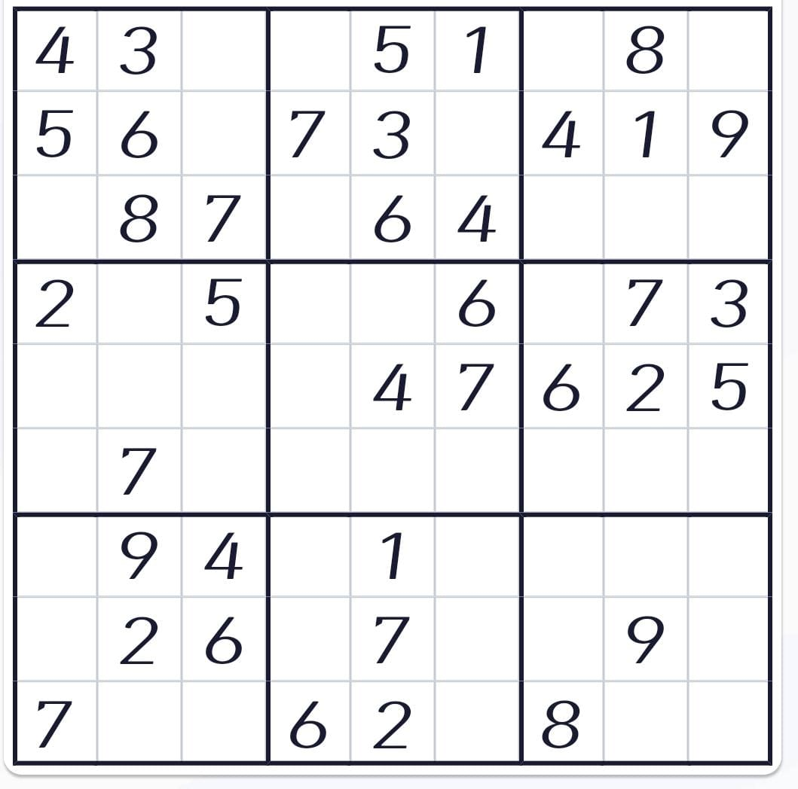
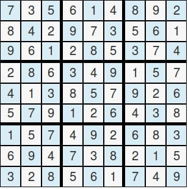

# sudoku

1. created a **Convoluted Neural Network** for digit recognition using **Numpy**

2. Increased efficieny by using `Tensorflow.keras`

3. Converted a sudoku grid image into 9*9 smaller grid using **cv2**

4. solved a sudoku puzzle using **py-solve**

